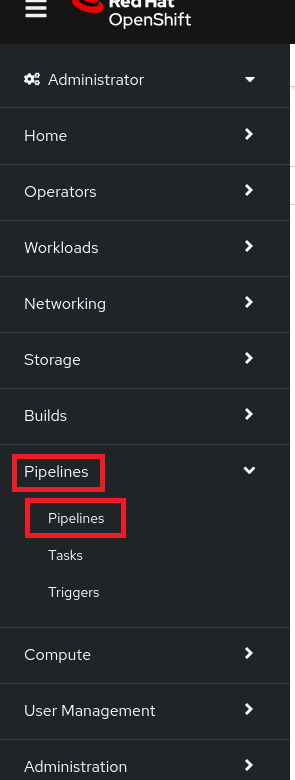

:scrollbar:
:toc2:
:numbered:

= Create golden image for Virtual Machines with OpenShift Virtualization and OpenShift Pipelines

:numbered:

This lab will introduce you to the basics of creating custom golden image with virt-customize and creation of VMs from the customized golden image in OpenShift Virtualization and OpenShift Pipelines. For more informations about advanced topics how OpenShift Virtualization in combination with Openshift Pipelines can be used, can be found in these blog posts https://www.redhat.com/en/blog/building-vm-images-using-tekton-and-secrets[Building VM images using Tekton and Secrets
] or https://www.redhat.com/en/blog/creating-a-golden-image-for-windows-vms-in-openshift-virtualization[Creating a Golden Image for Windows VMs in OpenShift Virtualization].

.Goals
* Copy RHEL9 image to new DataVolume
* Modifies it with virt-customize
* Create a new Virtual Machine from the golden disk

== Create new Pipeline
. Navigate to *Pipelines* -> *Pipelines*:
+

. Click *Create* -> *Pipeline*:
+
image::images/virtualization_pipelines/01_create_pipeline.png[]

. Click on Add task.
+
image::images/virtualization_pipelines/02_add_task.png[]

. Type `modify-data-object`. Select `modify-data-object` task and click add.
+

. Click on modify-data-object task in pipeline builder and update parameters with these values:
+
----
manifest:

apiVersion: cdi.kubevirt.io/v1beta1
kind: DataVolume
metadata:
  annotations:
    cdi.kubevirt.io/storage.bind.immediate.requested: "true"
  name: rhel9-gold
spec:
  storage:
    resources:
      requests:
        storage: 30Gi
    volumeMode: Filesystem
  sourceRef:
    kind: DataSource
    name: rhel9
    namespace: openshift-virtualization-os-images

waitForSuccess: true
allowReplace: true
----
+
The DataVolume will copy prepared RHEL9 image from openshift-virtualization-os-images namespace
+

. Click on the blue Plus icon next to modify-data-object task and add the disk-virt-customize task.
+

. Update parameters for disk-virt-customize task with these values:
+
----
pvc: $(tasks.modify-data-object.results.name)
----
+
----
customizeCommands:
run-command mkdir test-pipelines
run-command useradd -m shadowman
----
+
The task will add new user shadowman and create test folder inside the RHEL9 image.
+
image::images/virtualization_pipelines/24_disk_virt_customize_params.png[]

. Click on the blue Plus icon next to disk-virt-customize task and add the modify-data-object task.
+

. Update parameters for modify-data-object task with these values:
+

----
Display Name: create-datasource

manifest:

apiVersion: cdi.kubevirt.io/v1beta1
kind: DataSource
metadata:
  name: rhel9-gold
spec:
  source:
    pvc:
      name: $(tasks.modify-data-object.results.name)
      namespace: $(tasks.modify-data-object.results.namespace)

namespace: pipelines
waitForSuccess: true
----
+
This task creates Datasource object, which will point to Datavolume and PVC created in first task. The Datasource will be then used by Common Templates.
+

. Click on the blue Plus icon next to create-datasource task and add the create-vm-from-template task
+

. Update parameters for create-vm-from-template task with these values:
+
----
templateName: rhel9-desktop-small
templateNamespace: openshift

templateParams (each param has to be in its own input - click on Add Values for each parameter): 
CLOUD_USER_PASSWORD:test
DATA_SOURCE_NAME:$(tasks.create-datasource.results.name)
DATA_SOURCE_NAMESPACE:$(tasks.create-datasource.results.namespace)

vmNamespace: pipelines
startVM: true
----
+
CLOUD_USER_PASSWORD changes password for cloud-user user, 

DATA_SOURCE_NAME changes the name of Datasource which VM will use, to Datasource which is created in task create-datasource. 

DATA_SOURCE_NAMESPACE changes the namespace of Datasource which VM will use, to Datasource which is created in task create-datasource.
+

. Click on *Create*
+

. Click on *Actions* -> *Start*. The PipelineRun can take about 10 minutes to finish.
+

. Wait until PipelineRun finishes:
+
image::images/virtualization_pipelines/31_pipeline_finished.png[]

. Navigate to *Virtualization* -> *VirtualMachines*:
+

. Open the rhel-* VM and click on Console:
+

. Log in with
+
----
username: cloud-user
Password: test
----
+
and check that all commands from disk-virt-customize were executed with these commands:
+
----
cat /etc/passwd | grep shadowman
ls -l / | grep test-pipelines
----
+

. The rhel9-gold DataSource is now available to be used by other Virtual Machines.
