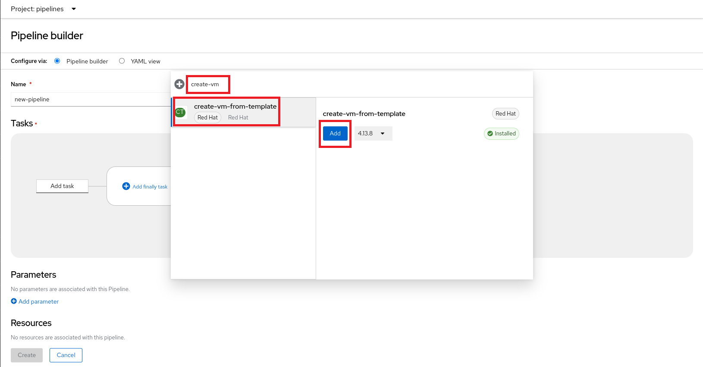

:scrollbar:
:toc2:
:numbered:

= Creating Virtual Machines with OpenShift Virtualization and OpenShift Pipelines

:numbered:

This lab will introduce you to the basics of creating VMs in OpenShift Virtualization and OpenShift Pipelines. OpenShift Virtualization in combination with OpenShift Pipelines can give you opportunity to automate advanced flows with Virtual Machines.

.Goals
* Create a new virtual machine with OpenShift Pipelines

== Create new Pipeline
. Navigate to *Pipelines* -> *Pipelines*:
+
image::images/virtualization_pipelines/00_pipelines_left_menu.png[]

. Click *Create* -> *Pipeline*:
+

. Click on Add task.
+

. Type `create-vm-from-template`. Select `create-vm-from-template` task and click add.
+

. Click on create-vm-from-template task in pipeline builder and update parameters for create-vm-from-template task with these values:
+
templateName:
+
----
rhel9-desktop-small
----
+
templateNamespace:
+
----
openshift
----
+
templateParams:
+
----
CLOUD_USER_PASSWORD:test
----
+
vmNamespace:
+
----
pipelines
----
+
startVM: 
+
----
true
----
+
The Virtual Machine will copy and use disk preprepared in openshift-virtualization-os-images namespace.
+

. Click on *Create*
+

. Click on *Actions* -> *Start*. The PipelineRun can take about 10 minutes to finish.
+

. Wait until PipelineRun finishes:
+

. Navigate to *Virtualization* -> *VirtualMachines*:
+

. Open the rhel9-* VM:
+

. Click on Console:
+

. Log in with
+
username:
+
----
cloud-user
----
+
Password:
+
----
test
----
+

